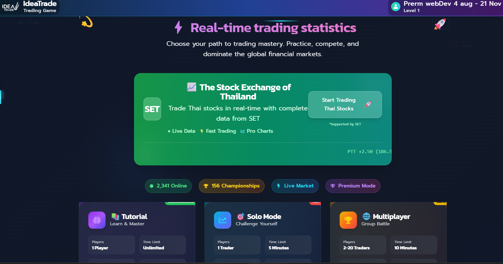
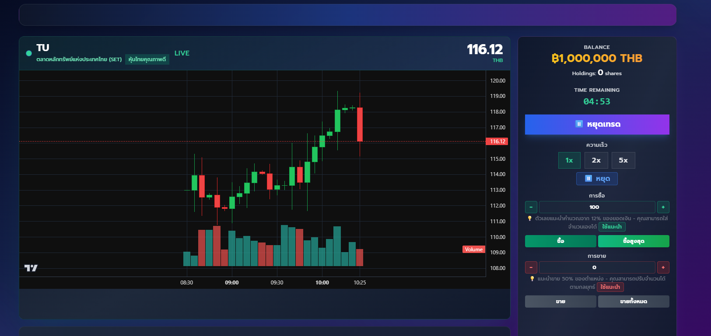
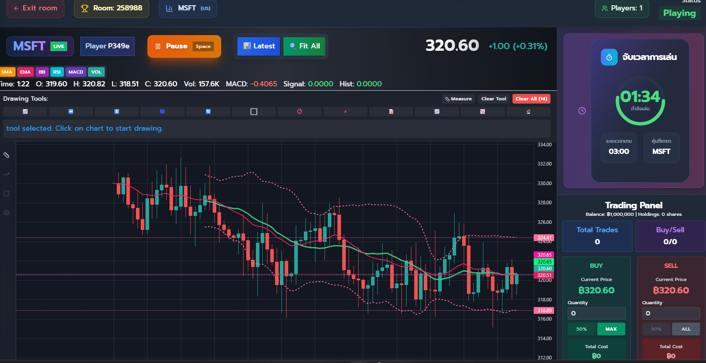
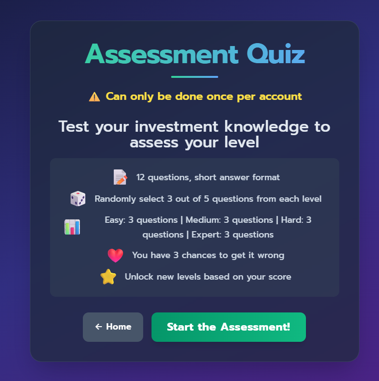

# Streaming IdeaTrade

A full-stack real-time stock trading simulation platform with multiplayer support, developed as an internship project.

## Live Demo

- **Frontend:** https://streaming-ideatrade.vercel.app
- **Backend API:** https://streaming-ideatrade-production.up.railway.app

## Screenshots

> Home / Main Menu



> Solo Trading



> Multiplayer Room



> Assessment Quiz



## Features

- **Solo Trading** — Trade stocks in Easy / Medium / Hard / Expert difficulty modes
- **Multiplayer** — Real-time competitive trading rooms with live leaderboard
- **Live Stock Data** — Real market prices from Yahoo Finance API (SET, MAI, TFEX, US Markets)
- **Level Assessment Quiz** — Evaluate investment knowledge with AI-graded short answers (one attempt per account)
- **Practice Quiz** — Unlimited practice quizzes without affecting your assessed level
- **AI Quiz Grader** — Automatic essay grading powered by Google Gemini AI
- **User Profiles** — Game history, stats, and ranking system
- **Responsive Design** — Works on desktop and mobile

## Tech Stack

**Frontend**
- React 18
- React Router
- Tailwind CSS
- Socket.IO Client
- ApexCharts / Chart.js

**Backend**
- Node.js + Express.js
- Socket.IO (real-time multiplayer)
- Google Gemini AI (quiz grading)
- Yahoo Finance API (stock data)

**Database & Auth**
- Supabase (PostgreSQL + Auth)

**Deployment**
- Vercel (frontend)
- Railway (backend)

## Architecture

```
React (Vercel)
      │
      ├── REST API ──► Express.js (Railway)
      │                     │
      └── WebSocket ────────┤
                            │
                     Supabase (PostgreSQL)
                            │
                     Google Gemini AI
                     Yahoo Finance API
```

## Installation

```bash
# Clone the repository
git clone https://github.com/ideatrade/streaming-ideatrade.git
cd streaming-ideatrade

# Install all dependencies
npm install
npm run install:all

# Configure environment variables
# server/.env
PORT=5000
GOOGLE_API_KEY=your_gemini_api_key
SUPABASE_URL=https://your-project.supabase.co
SUPABASE_SERVICE_ROLE_KEY=your-service-role-key

# client/.env.development
REACT_APP_API_BASE_URL=http://localhost:5000
REACT_APP_SOCKET_URL=http://localhost:5000

# Run in development
npm run dev
```

Open [http://localhost:3412](http://localhost:3412) in your browser.

## What I Learned

- Built a RESTful API with Express.js and connected it to a React frontend
- Implemented real-time bidirectional communication using Socket.IO for multiplayer gameplay
- Integrated Supabase for authentication and PostgreSQL-backed data persistence
- Used Google Gemini AI API to automatically grade open-ended quiz answers
- Deployed a full-stack application across two separate cloud platforms (Vercel + Railway) with proper CORS configuration
- Managed live stock market data from Yahoo Finance and rendered it with interactive charts

## Future Improvements

- Add unit and integration tests
- Implement notification system for game events
- Add portfolio analytics and performance tracking
- Introduce friend lists and private multiplayer rooms

---

**Developer:** IdeaTrade Team &nbsp;|&nbsp; **Version:** 1.0.0 &nbsp;|&nbsp; **Updated:** October 2025
